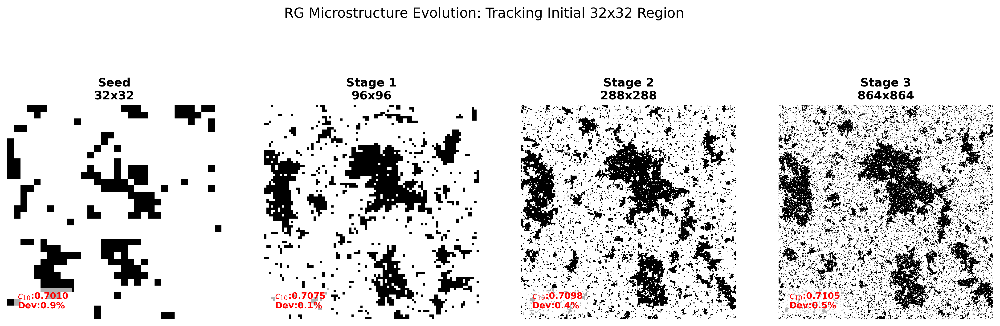
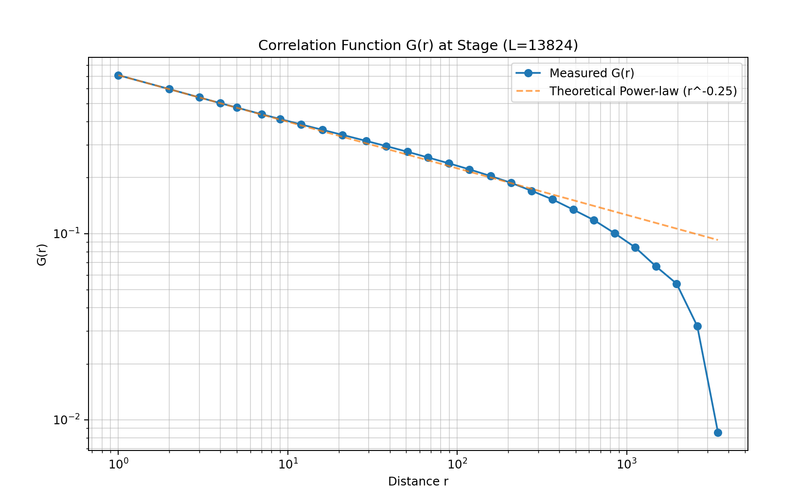

# CNN-RG-Fast_2D_Ising_model


### 🤖 AI Disclosure
This project was developed with the assistance of **AI**. The Ai tool helped me with the programming.

The core physical methodology (CNN-based Renormalization Group) and the neural network architecture remain the original research conceptualized by the author.

## Introduction

**Long story short: Using a bunch of 2048*2048 Ising model data, I trained a kernel that can do coarse-graining while forcing the engergy of the model tightly to nearest neighbor term, so that after graining, the spins are still a simple nearest-neighbor ising model. It makes it possiible to train a small spin congfig as a seed, and then using the kernel to generate large lattice while preserving the physical authenticity.**



This repository implements a high-performance **Inverse Renormalization Group (IRG)** framework using Convolutional Neural Networks (CNN). By training a physical 9 by 9 by 9 kernel to capture the statistical characteristics of the 2D Ising model at the critical temperature $T_c$, this framework enables the rapid generation of ultra-large spin configurations (up to $9000^2$ and beyond) while preserving physical authenticity.


---

## 🌟 Methodology

The core of this project lies in reversing the traditional Renormalization Group (RG) flow. While standard RG coarse-grains a system to extract long-range behavior, our "Neural RG" performs an inverse mapping to generate high-resolution critical configurations.

### 1. Neural Inverse-RG Operator
We define a generative operator based on a deep convolutional architecture designed to learn the local conditional probability of spins:
* **Kernel Projection**: A trained $9 \times 9$ convolutional kernel captures the multi-scale correlation functions inherent at the critical point ($\beta_c \approx 0.4407$).
* **Sub-pixel Reconstruction**: Utilizing a **PixelShuffle** layer, the model projects the latent information from a coarse grid into a $3 \times 3$ sub-lattice, effectively "filling in" the ultraviolet (UV) details lost during coarse-graining.

### 2. Preservation of the Critical Fixed Point
The methodology relies on the **Scale Invariance** of the 2D Ising model at criticality:
* **Fractal Projection**: By leveraging the self-similar nature of the system, the model can recursively apply the same RG kernel across multiple stages ($L \to 3L \to 9L \dots$) without drifting away from the critical manifold.
* **Nearest-Neighbor Constraint**: The kernel is optimized to ensure that the renormalized energy remains dominated by the nearest-neighbor term, preserving the Hamiltonian's structure across scales.

### 3. Hybrid Stochastic Evolution
To ensure the generated configurations are thermodynamically consistent, we employ a dual-path approach:
* **Neural Initialization**: The model performs a "Neural Direct" upsampling, providing a high-quality initialization that already approximates the target energy density ($c_{10} \approx 0.7071$).
* **Checkerboard Refinement**: A parallelized, high-speed **Checkerboard Metropolis** algorithm is applied for a minimal number of steps (Refine MC). This step acts as a physical "fine-tuner" to relax any local high-frequency artifacts introduced by the neural projection.


### 4. Recursive Multi-Scaling
The process is executed in discrete stages, allowing for the generation of massive lattices (e.g., $13824^2$) from small, well-equilibrated seeds. This bypasses the critical slowing down typically encountered in traditional large-scale Monte Carlo simulations.

---

## 📂 File Descriptions

According to the pipeline shown in the repository:

* **`data_collecting.py`**: Generates and saves raw Ising samples at the critical temperature. 
* **`batching.py`**: Batches up the data
* **`kernel_training_pixel_shuffle.py`**: Optimizes the CNN kernel by fitting the multi-scale correlation functions of the training data.
* **`fast_generating_single_stage.py`**: Performs a single $3 \times$ upscaling (e.g., $1000^2 \rightarrow 3000^2$).
* **`fast_generating_multi_stage.py`**: Executes recursive iterations for ultra-high resolution (e.g., $1000^2 \rightarrow 9000^2$ or larger).
* **`normal_fast_2d_Ising.py`**: A standard high-speed Ising simulator used for baseline comparison and seed generation.


---


## 🚀 Quick Start

### 1. Prerequisites
Ensure you have the following dependencies installed:
* Python 3.8+
* PyTorch
* NumPy
* Pillow (PIL)

### 2. Environment Configuration
To prevent OpenMP runtime conflicts during parallelized Monte Carlo steps, the following environment variable is required at the beginning of your execution script:
```python
import os
os.environ["KMP_DUPLICATE_LIB_OK"] = "TRUE"
```

### 3. Model Weight
Ensure the trained RG kernel is placed in the models/ directory. The current multi-stage script is configured to use: `models/full_conn_proj_k9_s3_2048_26_2_3.pt`. Or you kan train the kernel of your own. You can run the `kernel_training_pixel_shuffle.py`

### 4. Running the Multi-Stage Generation
Run generating scripts to generate high-resolution configurations.


### 5. Interpreting Results
The script will output a comparison gallery in the `gallery/` folder and a physics report in the console.Target Metric: The core validation is to ensure the c10 (Nearest-Neighbor Energy) remains consistently near the Onsager solution ($\approx 0.7071$) across all scales.Visualization:Top Row: Raw Neural RG output (UV-projections).Bottom Row: Physically refined configurations (Final output).


## VRAM (Video RAM) warning: 
The lattice size grows cubically or quadratically, and 9000x9000 already pushes the limits of many consumer GPUs.

This is a spin config it generates:


The measured correlation function $G(r)$ demonstrates a pretty good power-law decay consistent with the theoretical exponent $\eta=0.25$ over two orders of magnitude ($r \in [1, 500]$). This verifies that our NRG operator, trained with nearest-neighbor Hamiltonian constraints, effectively preserves the critical manifold throughout the multi-stage upsampling process. The deviation at $r > 10^3$ characterizes the finite correlation length under the current refinement steps.


